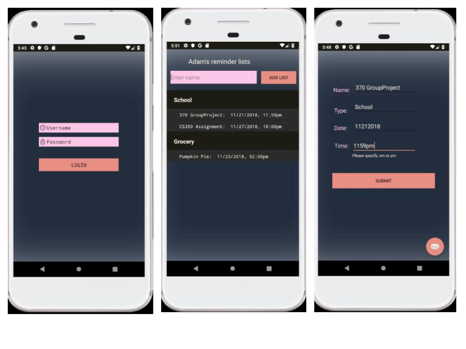

  
## Reminder Manager

#### **Reminder Manager** is a simple android application to manage a user's list of reminders with date, time, and location based alerts. Reminder Manager was created as part of a group project for CS370 Software Engineering.

### User Video Walkthrough

